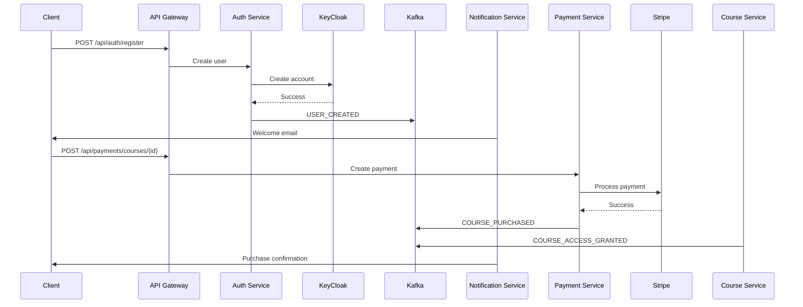
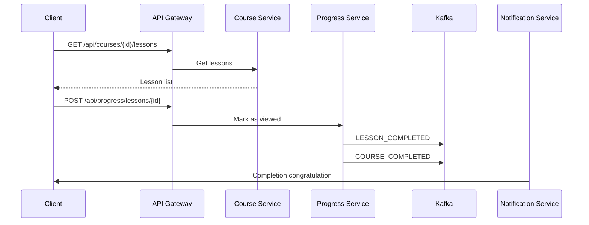

# Educational Platform Architecture

## System Overview

The educational platform is a microservices architecture built with NestJS. The system consists of several independent services that communicate through an API Gateway and message broker.

> **Note:** The single entry point for the application is the `api-orchestrator` service, which acts as the unified API gateway for all clients.

## Architectural Decisions

### 1. Monorepo

The choice of a monorepo is based on the following factors:
- Simplified dependency management
- Unified versioning
- Simplified CI/CD
- Local development

### 2. Microservices Architecture

Each service is responsible for a specific business function:
- Api Orchestrator Service - authentication, authorization, routing
- Course Service - course management
- User Service - user management
- Payment Service - payments
- Notification Service - notifications
- Progress Service - progress tracking

### 3. Service Communication

#### Synchronous Communication
- gRPC for internal communication

#### Asynchronous Communication
- Kafka for events
- WebSocket for real-time updates

## Service Details

### Authentication & Authorization (via Auth0)

Authentication and authorization are managed by **Auth0** (cloud-based IdP). All authentication and validation are handled in the `api-orchestrator` service, which integrates with Auth0 via OIDC/JWT.

#### Auth API Endpoints

| Method | Path                   | Description                       |
|--------|------------------------|-----------------------------------|
| POST   | /api/v1/auth/login     | Получение токенов (access/refresh)|
| POST   | /api/v1/auth/refresh   | Получение нового access токена    |
| POST   | /api/v1/auth/logout    | Разлогинивание пользователя       |
| GET    | /api/v1/auth/me        | Получение информации о пользователе (protected) |

##### Примеры запросов и ответов

**POST /api/v1/auth/login**
```json
{
  "username": "user@example.com",
  "password": "password"
}
```
Ответ:
```json
{
  "access_token": "...",
  "refresh_token": "...",
  "id_token": "...",
  "expires_in": 86400,
  "token_type": "Bearer"
}
```

**POST /api/v1/auth/refresh**
```json
{
  "refresh_token": "..."
}
```
Ответ:
```json
{
  "access_token": "...",
  "expires_in": 86400,
  "token_type": "Bearer"
}
```

**POST /api/v1/auth/logout**
- Без тела запроса. Делает redirect на logout страницу Auth0.

**GET /api/v1/auth/me**
- Требует заголовок Authorization: Bearer <access_token>
Ответ:
```json
{
  "id": "user-id",
  "email": "user@example.com",
  "name": "Test User",
  "roles": ["user"]
}
```

```typescript
interface IAuthService {
  login(credentials: LoginDto): Promise<TokenResponse>;
  refreshToken(token: string): Promise<TokenResponse>;
  validateToken(token: string): Promise<UserPayload>;
  getProfile(token: string): Promise<UserProfile>;
  logout(token: string): Promise<void>;
}
```

### Course Service

```typescript
interface ICourseService {
  createCourse(data: CreateCourseDto): Promise<Course>;
  updateCourse(id: string, data: UpdateCourseDto): Promise<Course>;
  getCourse(id: string): Promise<Course>;
  getLessons(courseId: string): Promise<Lesson[]>;
  addLesson(courseId: string, data: CreateLessonDto): Promise<Lesson>;
}
```

### Payment Service

```typescript
interface IPaymentService {
  createSubscription(userId: string, planId: string): Promise<Subscription>;
  cancelSubscription(subscriptionId: string): Promise<void>;
  purchaseCourse(userId: string, courseId: string): Promise<Payment>;
  processRefund(paymentId: string): Promise<Refund>;
}
```

### Notification Service

```typescript
interface INotificationService {
  sendEmail(to: string, template: string, data: any): Promise<void>;
  sendPush(userId: string, notification: PushNotification): Promise<void>;
  sendInAppNotification(userId: string, notification: InAppNotification): Promise<void>;
}
```

## Database

### PostgreSQL
- Main database
- Schemas per service
- Migrations via TypeORM

### Redis
- Caching
- Sessions
- Queues

## Security

### Auth0
- Cloud-based authentication and authorization provider
- OAuth 2.0 / OpenID Connect
- JWT validation in api-orchestrator
- Centralized authentication, authorization, and user management

- OAuth 2.0 / OpenID Connect
- Roles and permissions
- SSO

## Monitoring and Logging

### ELK Stack
- Centralized logging
- Analytics
- Visualization

### Prometheus + Grafana
- Metrics
- Alerts
- Dashboards

## Deployment

### Docker
- Service containerization
- Docker Compose for development
- Docker Swarm/Kubernetes for production

### CI/CD
- GitHub Actions
- Automated deployment
- Testing
- Linting

## Frontend

### Next.js
- SSR/SSG
- API Routes
- TypeScript
- Tailwind CSS
- ShadCn UI

## Kafka Events

```typescript
enum KafkaTopics {
  USER_EVENTS = 'user-events',
  COURSE_EVENTS = 'course-events',
  PAYMENT_EVENTS = 'payment-events',
  PROGRESS_EVENTS = 'progress-events',
  NOTIFICATION_EVENTS = 'notification-events'
}

interface KafkaEvent<T> {
  type: string;
  data: T;
  metadata: {
    timestamp: Date;
    correlationId: string;
  };
}
```

## Use Case Examples

### 1. Registration and Course Purchase



### 2. Course Progress



## Scaling

### Horizontal Scaling
- Service replication
- Load balancing
- Caching

### Vertical Scaling
- Query optimization
- Indexing
- Partitioning

## Backup

### Database
- Daily backups
- Point-in-time recovery
- Geo-replication

### Files
- Object storage
- CDN
- Replication 
