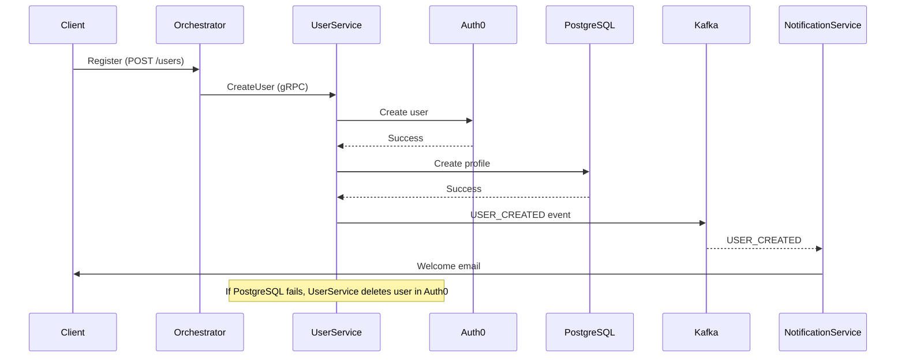

# User Service Flow and Interactions

## Synchronous Flow (gRPC)
- API Orchestrator calls `CreateUser` via gRPC
- User Service:
  1. Creates user in Auth0 (Auth0 Management API)
  2. If successful, creates user profile in PostgreSQL
  3. If DB step fails, deletes user in Auth0 (rollback)
  4. If all successful, publishes `USER_CREATED` event to Kafka

## Asynchronous Flow (Kafka)
- Notification Service subscribes to `USER_CREATED` events
- On receiving event, sends welcome email to new user

## Sequence Diagram (mermaid)


## gRPC Contract
See `user-service-grpc.proto` in this folder.

## Kafka Event Example
```json
{
  "type": "USER_CREATED",
  "data": {
    "id": "user-123",
    "email": "user@example.com",
    "name": "John Doe"
  },
  "metadata": {
    "timestamp": "2025-04-25T20:12:00Z",
    "correlationId": "req-456"
  }
}
```
